# Motor de Ingesta de Datos para FarmIA

## 1. Resumen del Proyecto

Este proyecto implementa un motor de ingesta de datos modular y configurable en Python, utilizando Apache Spark (versión 3.5.x). Está diseñado para procesar diversas fuentes de datos para la startup agrícola FarmIA. El motor se estructura como un paquete Python (`farmia_engine`) y sigue una arquitectura de lago de datos por etapas:

1.a.  **Landing a Raw:** Ingesta datos de fuentes externas (actualmente CSV) desde una zona de aterrizaje (`landing`) a una capa cruda (`raw`) en formato Parquet. Este paso incluye la adición de metadatos, particionamiento configurable y archivado de los archivos fuente procesados.
1.b   **Streaning Kafka a Raw:** Ingesta datos desde Instancia de Kafka a una capa cruda (`raw`) en formato Parquet. Este paso incluye la adición de metadatos, particionamiento configurable y archivado de los archivos fuente procesados.
2.  **Raw a Bronze:** Promueve los datos Parquet de la capa `raw` a una capa `bronze` como tablas Delta Lake. Este paso incluye la derivación de columnas de partición específicas para `bronze` (ej. `event_year`, `event_month`), aplicación de `mergeSchema` para la evolución del esquema y registro opcional de tablas en el metastore de Databricks.

El sistema es compatible con ejecución local y en Azure Databricks. En Databricks, puede aprovechar Autoloader para la ingesta incremental y el procesamiento por microlotes (`foreachBatch`).

## 2. Prerrequisitos

### 2.1. Generales
* **Python:** Se recomienda **Python 3.10 o 3.11** para una óptima compatibilidad con Apache Spark 3.5.x. Versiones como Python 3.12 podrían tener compatibilidad parcial, y versiones más recientes como Python 3.13 **no son compatibles actualmente** con Apache Spark 3.5.x.
* **Git:** Para control de versiones del código.
* **Kafka (para streaming):** Una instancia de Kafka local o accesible para las pruebas de streaming.

### 2.2. Para Empaquetado y Desarrollo Local
* **Python y Pip:** Versión 3.10 o 3.11.
* **Bibliotecas Python (para `requirements.txt`):**
    * `pyspark>=3.5.0,<3.6.0`
    * `delta-spark>=3.1.0,<3.2.0` (alineado con `DELTA_LAKE_VERSION` en `utils.py`)
    * `kafka-python` (para el script productor de Kafka)
    * `setuptools`
    * `wheel`
* **Java Development Kit (JDK):** Versión 8 o 11 recomendada (`JAVA_HOME` configurada).
* **Apache Spark 3.5.x:** (`SPARK_HOME` configurada, `bin` en `PATH`).

### 2.3. Para Generación de Datos de Muestra (Opcional, script `scripts/generate_sample_data.py`)
* Bibliotecas Python adicionales: `avro-python3`, `pyarrow`, `Pillow`.

Se explicará más adelante uso paso a paso en el pipeline local.

### 2.4. Para Ejecución en Azure Databricks
* **Suscripción de Azure.**
* **Azure Databricks Workspace.**
* **Clúster de Databricks:** Con DBR compatible con Spark 3.5.x y Python 3.10/3.11.
* **Azure Data Lake Storage (ADLS) Gen2:** Cuenta y contenedores para `landing`, `raw`, `bronze`, `archive` y metadatos.
* **Permisos:** Acceso del clúster a ADLS Gen2 (se recomienda Service Principal).

## 3. Estructura del Proyecto

```
farmia_project/
├── farmia_engine/              # Paquete Python con la lógica principal
│   ├── __init__.py
│   ├── utils.py                # Funciones de utilidad (SparkSession, paths, config, etc.)
│   ├── landing_to_raw_processors.py  # Clases Reader/Writer para landing -> raw (Parquet)
│   ├── raw_to_bronze_processors.py   # Clases Reader/Writer para raw -> bronze (Delta)
│   └── main_orchestrators.py   # Funciones orquestadoras callable (execute_landing_to_raw, etc.)
├── scripts/   # Scripts ejecutables para utilidades y ejecución local/databricks
│   ├── for_databricks/     
│   │    ├── generar_sample_data.py # Genera datos de muestra
│   │    └──  prueba_farmia_engine.py  # Pipeline de ejeción para csv landing->raw->bronze   
│   ├── generate_sample_data.py # Genera datos de muestra
│   ├── run_kafka_stream_to_raw.py # Ejecuta la etapa kafka stream->raw localmente
│   ├── run_local_landing_to_raw.py  # Ejecuta la etapa landing->raw localmente
│   ├── run_local_raw_to_bronze.py   # Ejecuta la etapa raw->bronze localmente
│   ├── query_raw_layer.py      # Script para consultar la capa raw local
│   └── query_bronze_layer.py   # Script para consultar la capa bronze local
├── config.json                 # Archivo de configuración central
├── farmia_ingest_config.json   # Archivo de configuración para ocupar en databricks (igual a config.json pero con sólo lo necesario)
├── setup.py                    # Script para construir el paquete wheel
├── requirements.txt            # Dependencias Python para entorno local
└── README.md                   # Detalle Implementación
```

## 4. Configuración (`config.json`)

El archivo `config.json`, ubicado en la raíz del proyecto, es el pilar fundamental para el funcionamiento dinámico y adaptable de este motor de ingesta. Permite definir cómo se procesan los datos en diferentes entornos (local y Databricks) y para cada etapa del pipeline (landing, raw, bronze), sin necesidad de modificar el código Python.

**Es crucial reemplazar los placeholders (ej. `<TU_CUENTA_ALMACENAMIENTO>`) con los valores reales de tu infraestructura.**

Para la ejecución en Databricks, este archivo debe ser subido a DBFS. Por defecto, el motor de ingesta (a través de `utils.py`) espera encontrarlo en `/FileStore/configs/farmia_ingest_config.json`.

### 4.1. Secciones Principales de Configuración

El archivo `config.json` se organiza en las siguientes secciones de alto nivel:

* **`adls_config_base`**: (Específico para Databricks) Define los parámetros de conexión a tu Azure Data Lake Storage Gen2.
    * `storage_account_name`: Nombre de tu cuenta ADLS. Puede ser un placeholder si se configura para obtenerlo dinámicamente de la sesión de Spark en Databricks.
    * `container_landing`: Nombre del contenedor para la capa Landing.
    * `container_raw`: Nombre del contenedor para la capa Raw.
    * `container_bronze`: Nombre del contenedor para la capa Bronze.
    * `container_archive`: Nombre del contenedor para los archivos de Landing procesados.
    * `container_autoloader_metadata`: Nombre del contenedor para almacenar metadatos de Autoloader y checkpoints de streaming.

* **`local_env_config`**: (Específico para ejecución local) Define las rutas base en tu sistema de archivos local.
    * `landing_base_path`: Carpeta raíz para los datos fuente de Landing.
    * `raw_base_path`: Carpeta raíz para los datos procesados de la capa Raw.
    * `bronze_base_path`: Carpeta raíz para los datos procesados de la capa Bronze.
    * `archive_base_path`: Carpeta raíz para los archivos de Landing archivados.
    * `streaming_checkpoint_base_path`: Carpeta raíz local para los checkpoints de los flujos de streaming.

* **`databricks_env_config`**: (Específico para Databricks) Define las subrutas relativas base *dentro* de los contenedores ADLS especificados en `adls_config_base`. Esto ayuda a organizar los datos por proyecto o capa dentro de cada contenedor.
    * Ejemplos: `landing_base_relative_path`, `raw_base_relative_path`, `streaming_checkpoints_base_relative_path`. Si `landing_base_relative_path` es `""`, los datos se colocan directamente bajo el contenedor; si es `"mi_proyecto/landing/"`, se crea esa subestructura.

* **Listas de Datasets a Procesar**: Estas arrays controlan qué datasets específicos se ejecutan en cada uno de los pipelines principales. Los nombres aquí deben coincidir con las claves definidas en `dataset_configs`.
    * `datasets_to_ingest_to_raw`: Para el pipeline Landing (archivos) -> Raw.
    * `datasets_to_promote_to_bronze`: Para el pipeline Raw -> Bronze.
    * `active_streaming_pipelines` (o `datasets_to_stream_kafka_to_raw`): Para pipelines de streaming Kafka -> Raw.

### 4.2. `dataset_configs`: Configuraciones Detalladas por Dataset

Esta es la sección más granular, un diccionario donde cada clave es un **nombre único que identifica un dataset** (ej. `"sales_online_csv"`, `"sensor_telemetry_kafka"`). El valor asociado a cada clave es un objeto JSON que detalla todas las configuraciones para ese dataset en particular, a través de las diferentes etapas del pipeline:

* **`type`** (Importante): Un string que identifica el tipo de datos de origen y, por lo tanto, el pipeline o procesador que se debe utilizar (ej. `"csv"`, `"kafka_avro_payload_to_raw_parquet_files"`).

* **Rutas Específicas del Dataset (Subrutas)**:
    * `source_subpath`: (Para fuentes de archivos) Subruta dentro de la `landing_base_path` o `landing_base_relative_path`.
    * `raw_target_subpath` (o `raw_target_parquet_files_subpath`, `raw_target_delta_subpath` según el caso): Subruta de destino en la capa `raw`, relativa a `raw_base_path` o `raw_base_relative_path`.
    * `archive_subpath`: Subruta para los archivos de `landing` procesados, relativa a `archive_base_path` o `archive_base_relative_path`.

* **Configuraciones de Lectura y Esquema (Principalmente para Landing -> Raw):**
    * `schema_config`: (Para formatos como CSV) Un objeto que define la estructura (`fields`) y tipos de datos de las columnas. Cada campo tiene `name`, `type` (ej. `"string"`, `"integer"`, `"timestamp"`) y opcionalmente `format` para timestamps.
    * `reader_options`: (Para formatos como CSV) Un objeto con opciones específicas para el lector de Spark (ej. `{"header": "true", "delimiter": ","}`).
    * `value_avro_schema_string`: (Para streams de Kafka con payload Avro) El esquema Avro completo del mensaje (el campo `value`) como una **cadena JSON válida y escapada**.
    * `kafka_options`: Parámetros de conexión a Kafka, incluyendo `kafka.bootstrap.servers`, `subscribe` (topic), `startingOffsets`, etc.
    * `autoloader_schema_evolution_mode`: (Para Autoloader en Databricks) Define cómo manejar la evolución del esquema (ej. `"addNewColumns"`).

* **Configuraciones de Escritura en Raw (Salida de Landing -> Raw o Kafka -> Raw):**
    * `partition_config`: (Para ingesta batch de archivos a `raw`) Define cómo particionar los datos en la capa `raw` (ej. `columns_to_partition_by: ["year", "month", "day"]` y `derive_date_parts_from_column: "order_date"`).
    * `raw_stream_partition_by`: (Para ingesta streaming de Kafka a `raw`) Define las columnas para particionar la salida del stream en la capa `raw` (ej. `["ingestion_date", "kafka_topic"]`).
    * `raw_stream_checkpoint_subpath`: Subruta para el checkpoint del stream que escribe a la capa `raw`.

* **`bronze_config`**: Una sub-sección completa para la promoción de `raw` a `bronze`. Contiene:
    * `enabled`: Booleano para activar o desactivar la promoción a `bronze` para este dataset.
    * `raw_source_format`: Formato de los datos que se leerán de la capa `raw` (ej. `"parquet"`, `"delta"`, `"avro"`).
    * `bronze_target_subpath_delta`: Subruta de destino para la tabla Delta en la capa `bronze`.
    * `bronze_database_name`, `bronze_table_name`: Para registrar la tabla en el metastore de Databricks.
    * `bronze_partition_columns_derivation`: Objeto que define cómo derivar nuevas columnas para el particionamiento de `bronze` (ej. `source_column`, `year_col_name`, `month_col_name`).
    * `partition_by_bronze`: Lista de las columnas finales por las cuales se particionará la tabla Delta `bronze`.
    * `merge_schema_on_write`: Booleano (generalmente `true`) para permitir que el esquema de la tabla Delta `bronze` evolucione.
    * `autoloader_for_raw_source`: Booleano para indicar si se debe usar Autoloader para leer incrementalmente desde la capa `raw` (si es un stream `raw` -> `bronze`).
    * `autoloader_raw_schema_evolution_mode`: Modo de evolución para Autoloader si lee de `raw`.
    * `bronze_stream_checkpoint_subpath`: Subruta para el checkpoint si la promoción `raw -> bronze` es un proceso de streaming.

La correcta configuración de este archivo es esencial para que el motor de ingesta funcione como se espera, adaptándose a diferentes datasets y entornos. Las rutas completas son construidas dinámicamente por `utils.construct_full_paths_for_dataset` utilizando la información de estas secciones.

## 5. Generación de Datos de Muestra

El script `scripts/generate_sample_data.py` crea archivos de ejemplo en `farmia_project/sample_data/landing/`.
1.  Asegurar dependencias (ver Prerrequisitos 2.3).
2.  Desde el directorio raíz `farmia_project/`, ejecutar:
    ```bash
    python scripts/generate_sample_data.py
    ```
    Estos datos pueden ser usados para pruebas locales o subidos a ADLS para pruebas en Databricks.


### Ejemplo uso:


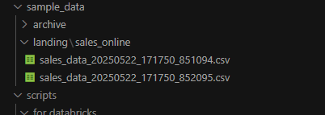


## 6. Desarrollo y Ejecución Local


1.  **Configurar Entorno:** Python 3.10/3.11, JDK, Apache Spark 3.5.x.
2.  **Instalar Dependencias:** Desde `farmia_project/`, ejecutar `pip install -r requirements.txt`.
    ```txt
    # requirements.txt (ejemplo)
    pyspark>=3.5.0,<3.6.0
    delta-spark>=3.1.0,<3.2.0 # Para DeltaTable API y compatibilidad local
    # Opcional para generate_sample_data.py:
    # avro-python3
    # pyarrow
    # Pillow
    ```
3.  **Actualizar `config.json`:** Configurar `local_env_config` y las secciones de dataset relevantes.
4.  **Ejecutar Etapas:** Desde el directorio raíz `farmia_project/`:
    * **Landing -> Raw:**
        ```bash
        python scripts/run_local_landing_to_raw.py
        ```
    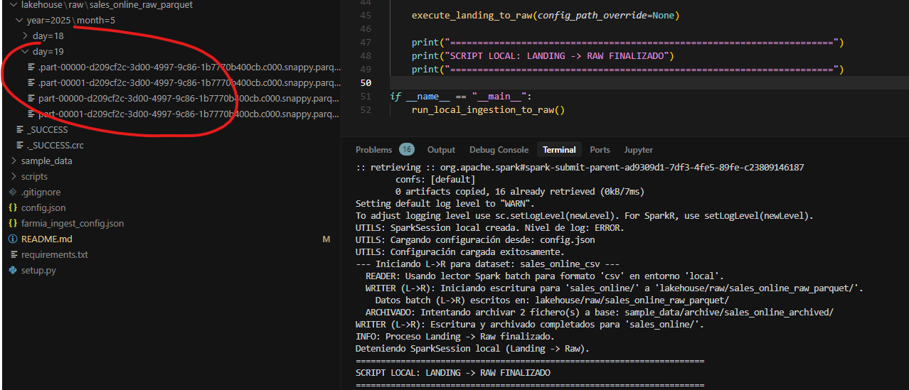
    


    * **Raw -> Bronze (después de landing->raw):**
        ```bash
        python scripts/run_local_raw_to_bronze.py
        ```

    
    
5.  **Validar Datos Localmente:**

    Para la validación de los datos ingestados y promovidos a bronze se incorporan dos script con consultas.

    * Para la capa Raw (Parquet):
        ```bash
        python scripts/query_raw_layer.py <nombre_dataset_config_key> 
        # Ejemplo: python scripts/query_raw_layer.py sales_online_csv
        ```
    * Para la capa Bronze (Delta):
        ```bash
        python scripts/query_bronze_layer.py <nombre_dataset_config_key>
        # Ejemplo: python scripts/query_bronze_layer.py sales_online_csv
        ```

    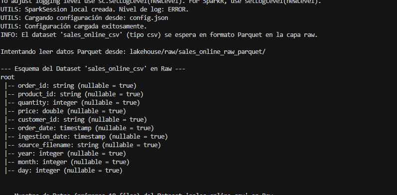

    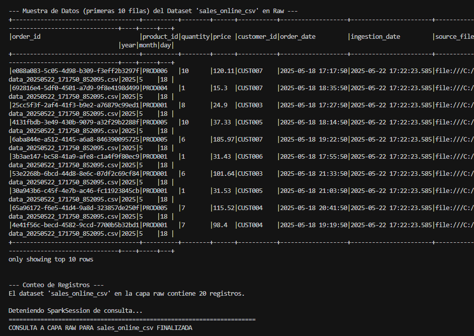


6.  **Para uso de Kafka:**

    Se debe hacer uso ambiente de curso Kafka.

    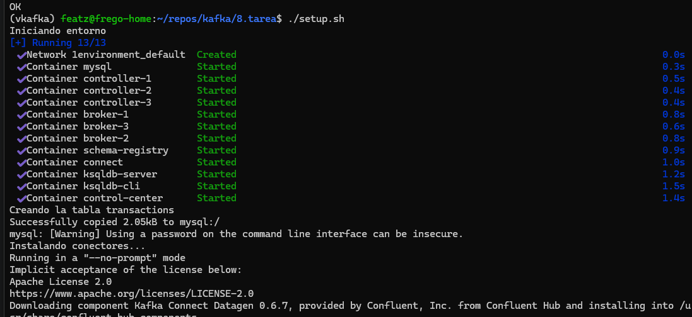

    Se hará uso del topic sensor-telemetry

    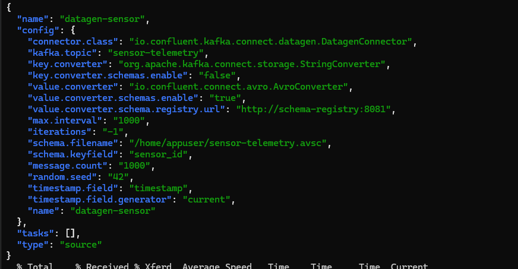


    * Para el streaming kafka a raw se debe ejecutar:
        ```bash
        python ./scripts/run_kafka_stream_to_raw.py
        ```
    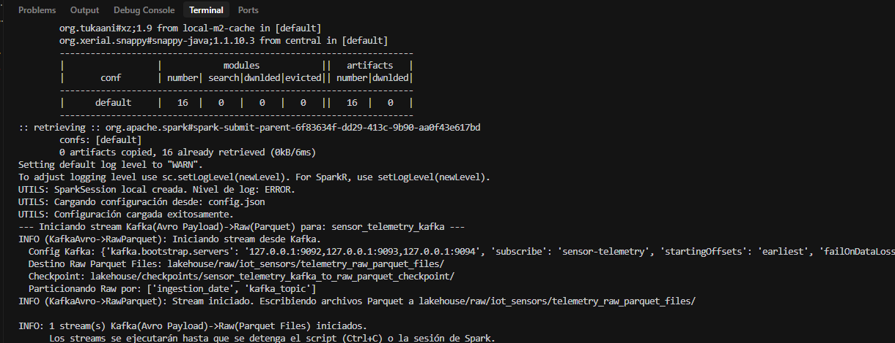


    * Se puede usar la query anterior para consultar y validar archivos.
    ```bash
        python scripts/query_raw_layer.py sensor_telemetry_kakfa
    ``` 


     * Para la promoción de raw a bronze se debe ejecutar:
        ```bash
        python ./scripts/run_local_raw_to_bronze.py 
        ```
    *Es el mismo script usando para bash. Unifiqué esta logica ya que todo está en parquet, y procesa según haya disponibilidad de archivos en raw.


## 7. Empaquetado como Wheel (`farmia_engine`)

Empaquetar el código en `farmia_engine/` como un archivo wheel permite una fácil instalación en clústeres de Databricks.

1.  **Crear `setup.py`:** En el directorio raíz `farmia_project/`, crea `setup.py`:
    ```python
    # setup.py
    from setuptools import setup, find_packages

        setup(
        name="farmia_engine",
        version="0.1.1",
        author="Fernando Regodeceves",
        description="Motor de ingesta de datos para FarmIA",
        long_description="Un motor de ingesta de datos que procesa archivos y los mueve a través de las capas de un data lakehouse (landing, raw, bronze).",
        packages=find_packages(where="."), 
        install_requires=[
            "pyspark>=3.5.0", 
        ],
        python_requires='>=3.10, <=3.11.11', # Especifica versiones de Python compatibles
        classifiers=[
            "Programming Language :: Python :: 3",
            "Operating System :: OS Independent",
        ],
    )
    ```
2.  **Construir el Wheel:** Desde la terminal, en el directorio `farmia_project/`:
    ```bash
    python setup.py bdist_wheel
    ```
    Esto generará un archivo `.whl` en el subdirectorio `dist/`.

## 8. Despliegue y Configuración Inicial en Azure Databricks

Antes de ejecutar los notebooks de demostración, es necesario realizar la siguiente configuración en tu entorno de Azure Databricks:

1.  **Construir e Instalar el Paquete Wheel:**
    * Localmente, en el directorio raíz `farmia_project/`, construye el paquete:
        ```bash
        python setup.py bdist_wheel 
        ```
        (Opcionalmente, usa el método más moderno: `python -m build --wheel` si tienes el paquete `build` instalado).
    * Sube el archivo `.whl` generado (desde la carpeta `dist/`) a tu clúster de Databricks a través de la pestaña "Libraries" ("Compute" -> selecciona tu clúster -> "Libraries" -> "Install New" -> "Upload" -> "Python Whl"). Asegúrate de que se instale correctamente en el clúster que usarás.


    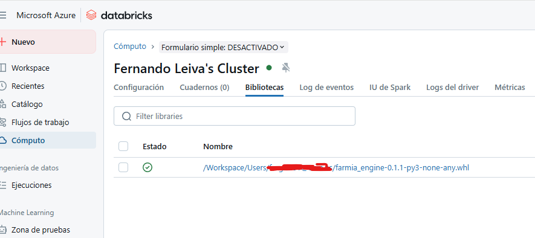


2.  **Subir `config.json` a DBFS:**
    * Asegúrate de que tu archivo `config.json` esté actualizado con los nombres correctos de tu cuenta de almacenamiento ADLS Gen2, contenedores y las rutas relativas deseadas para el entorno Databricks.
    * Súbelo a la ruta de DBFS que espera `utils.py`. Por defecto, esta es `/FileStore/configs/farmia_ingest_config.json` (la ruta para `open()` sería `/dbfs/FileStore/configs/farmia_ingest_config.json`).

    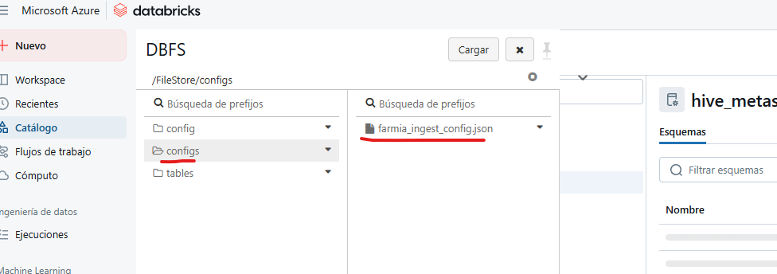


3.  **Configurar Acceso del Clúster a ADLS Gen2:**
    * Asegura que tu clúster de Databricks tenga los permisos necesarios para leer, escribir y mover datos en las rutas de ADLS Gen2 que has configurado. Se recomienda el uso de un Service Principal cuyas credenciales se configuran en el clúster de Spark (a través de la UI del clúster en "Advanced Options" -> "Spark") o mediante un script de inicialización.

## 9. Demostración del Pipeline en Databricks con Notebooks

Esta sección describe un flujo de trabajo para demostrar el motor de ingesta completo en Databricks, utilizando dos notebooks principales: uno para generar datos de muestra directamente en ADLS (`generar_sample_data.ipynb`) y otro para orquestar y validar el pipeline (`prueba_farmia_engine.ipynb`).

Detalle de ejecución en cada notebook.


El flujo a seguir es generar un archivo con `generar_sample_data.ipynb` , indicando schema original.

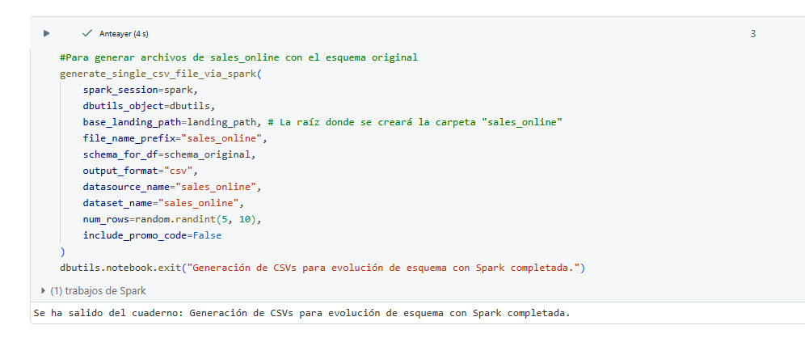


Desde `prueba_farmia_engine.ipynb` se puede realizar el pipeline de landing a raw y luego raw a bronze. Se añaden querys para validar los movimientos.

### Landing to raw
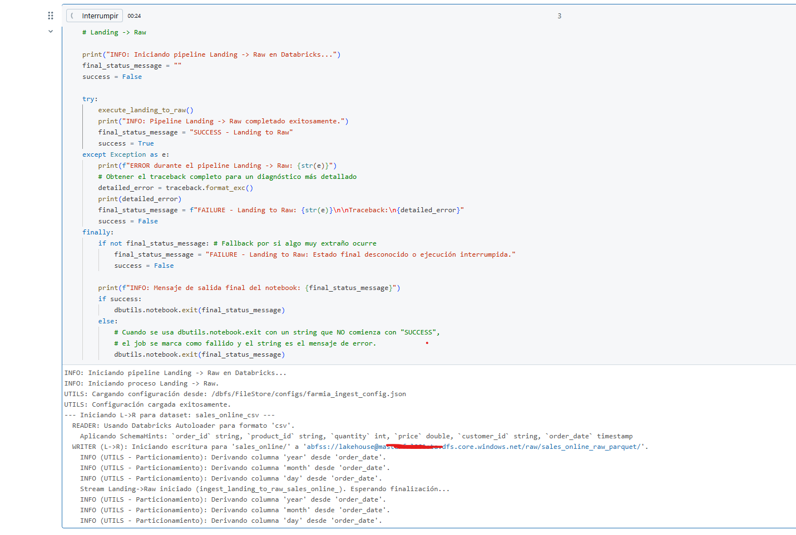

### Query sobre raw
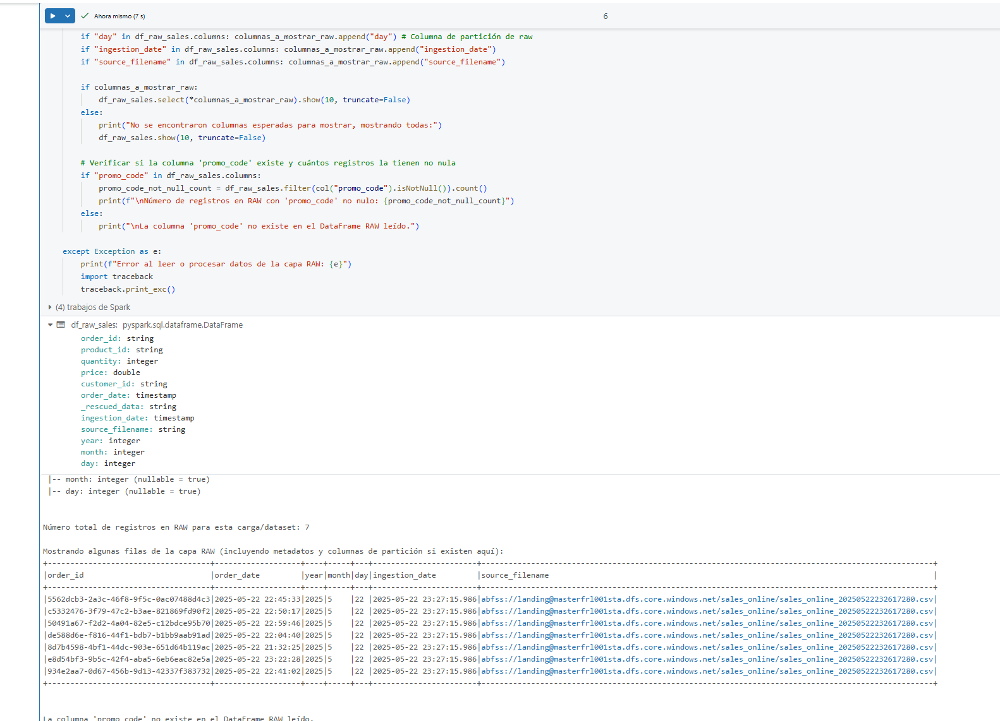


### Luego de ejecutar raw to bronze. Query sobre bronze

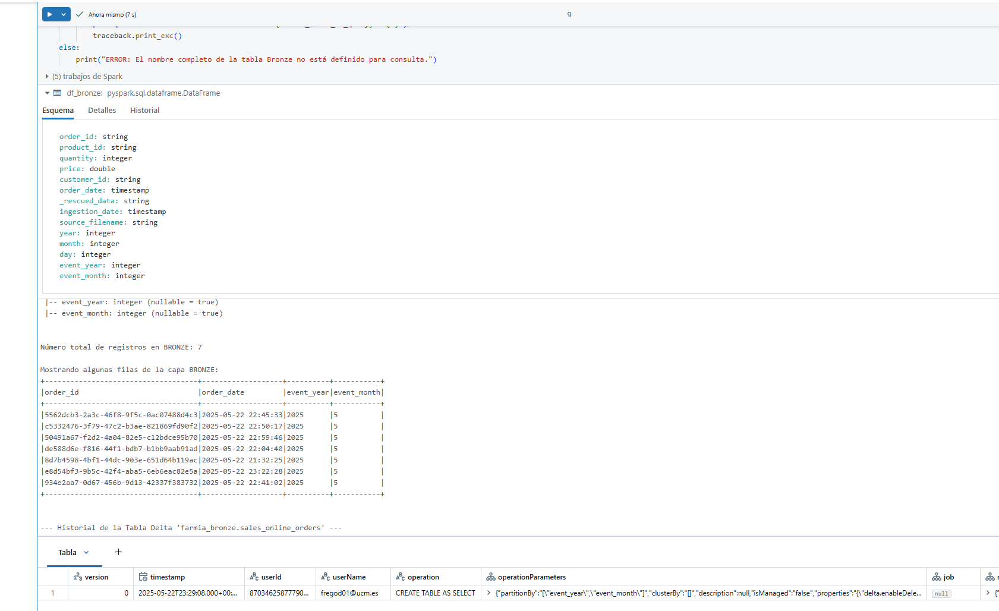


Luego, para validar la evolucion de schema se puede volver a `generar_sample_data.ipynb` generando archivo con columna extra.


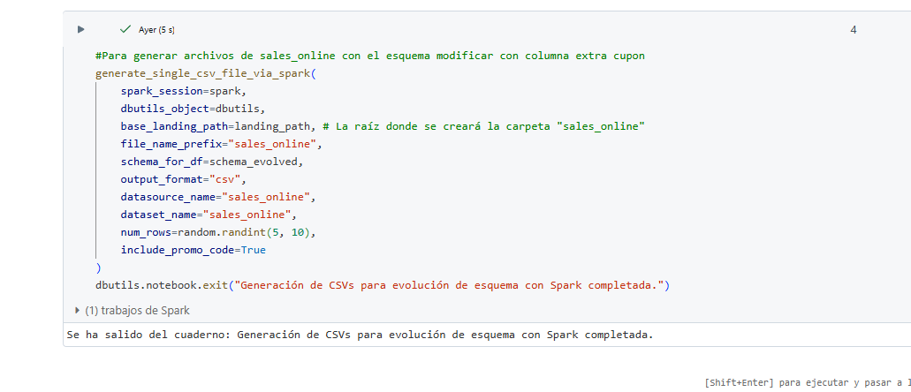


Se debe volver a ejecutar las celdas de `prueba_farmia_engine.ipynb`. Es importante mencionar que al primer intento autoloader reconoce que existe una nuva columna, y arroja un error.

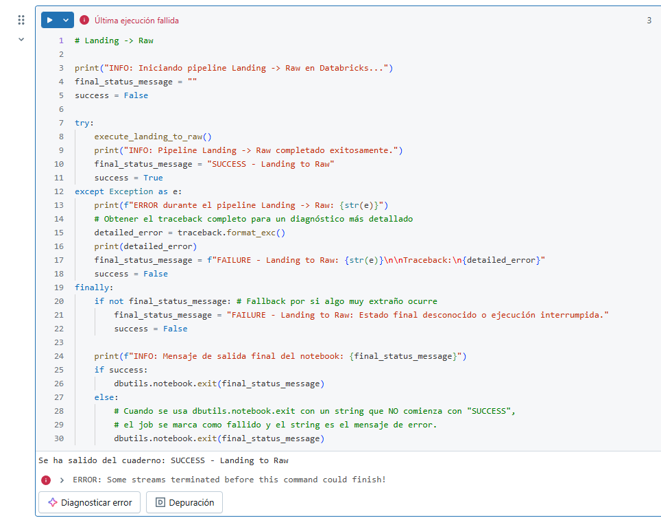


Para solucionar basta volver a ajecutar la celda. Autoloader primero detecta, señala el cambio (con la excepción), actualiza su definición de esquema internamente y luego, en un reintento, procesa los datos con el nuevo esquema completo. Esto asegura que los cambios de esquema no pasen desapercibidos y que el sistema pueda adaptarse. El reintento para manejar la evolución del esquema detectada por Autoloader se gestiona de manera ideal y automática a través de la configuración de reintentos de los Databricks Jobs.


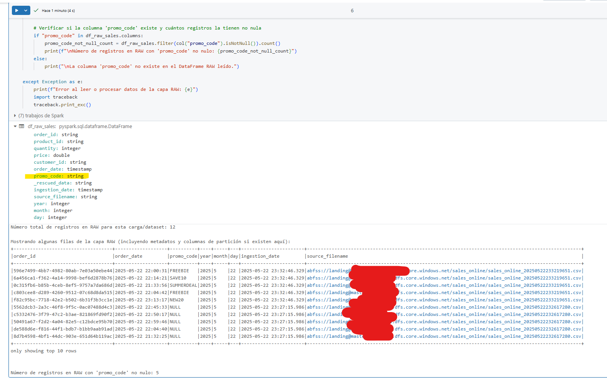


## 10. Notas Adicionales

### Problemas de Cierre de Spark en Windows (Ejecución Local)
Durante la ejecución local en Windows, al finalizar el script y detener Spark (`spark.stop()`), es común observar mensajes como `WARN SparkEnv` o `ERROR ShutdownHookManager` relacionados con `java.io.IOException: Failed to delete ... temp dir ...`.
* **Causa:** Windows a veces mantiene bloqueados archivos temporales que Spark intenta eliminar.
* **Impacto:** Generalmente, esto **no afecta la correctitud de los datos procesados** si el resto del log indica que la ingesta fue exitosa. Es más una molestia en el entorno de desarrollo local.
* **Mitigación:** La función `utils.get_spark_session()` configura el nivel de log de Spark a `ERROR` para ejecuciones locales, lo que puede reducir la verbosidad, pero podría no suprimir completamente estos errores específicos de cierre de la JVM.

## 11. Mejoras Futuras (Opcional)
* Soporte completo para más tipos de archivos (JSON, imágenes).
* Manejo de errores y reintentos avanzado.
* Notificaciones.
* Pruebas unitarias y de integración.
* Modificar Partición en Bronze para Sensores por sensor-id.